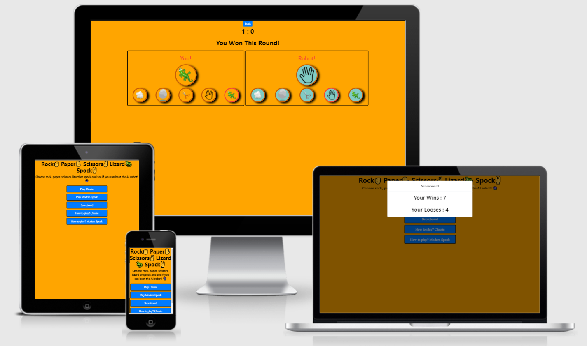
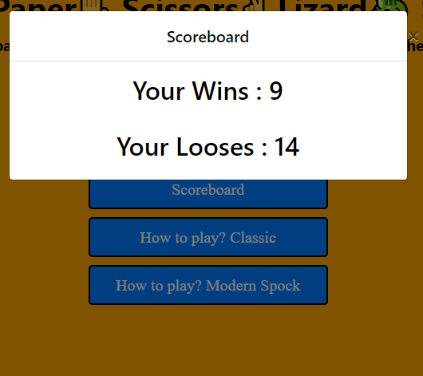

# Rock, Paper, Scissors, Lizard or Spock game (RPSLS)!

## About 

The game was built upon the real life game where 2 persons have a battle with hand gestures.
To make this even more fun are you now able to play with the "AI" computer.
This game is and have always depend on luck to win! Try out your luck today and make the choice of how many rounds you want to play!

Give it a try!

[Click here to play the live game/project.](https://saleh88hbg.github.io/RPSLS-GAME-MS2/)

[Read more about the real life game and rules!](https://en.wikipedia.org/wiki/Rock_paper_scissors#Additional_weapons)

## User Experriense

## Features 

### Existing Features

- __Homepage__

  - Featured on first screen
  - This section will allow the user to easily understand the purpose of the website. 

- __Menu__

  - The menu is fixed and installed on the first page to make it possible to the user to achieve his goal with the site " To Play "
  - Menu section have been designed and programed so the user can have ability to choose level or game type.
  - Level easy is the "Classic" game mode where the user only have three alternative to play with "Rock, Paper, Scissors"
  - Level hard is the upgrade version of the game called "Modern" this game mode add two more in-game weapons to gain a win.
  - Level hard weapons is two more gestures that can be used to eliminate the computer "by luck".
  - Level hard weapons added is " Lizard and Spock " for more information please refer to the rules in game or go up in this readme section to read more.

- __Menu "Play" section__

  - In the play section user can interact with the chose of game mode.
  - User can eather play "classic" or "modern" mode.
 

- __Menu "Chose rounds to play" section__

  - After the user determine wich game mode they want to play.
  - The user will get the option to chose how many rounds they want to play "5 rounds, 10 rounds or unlimited rounds"
 

- __Menu "How to play" section__

  - How to play section will give the user a proper understandig and information about the game rules.
  - This will give the user an understanding of the logic in the game and who and why the winner win.

- __Menu "Scoreboard" section__

  - The application will have the ability to provide the user with high scores to determine how much luck they had.
  - The user will gain information about the score in proper to have highscore.

- __Game "In game mode Classic" section__

  - The user will have the ability to play three "cards" gestures.
  - The score point in game is linked to the rounds, for each win/round will increase the score.
  - Information regarding who won the round will appear on screen.
  - Information regarding who won the whole game will appear on screen "Only if game rounds set to 5 or 10 rounds.
  - The chosen card/gesture will elevate to the play deck.  

- __Game "In game mode Modern" section__

  - The user will have the ability to play five "cards" gestures.
  - The score point is linked to the rounds, for each win/round will increase the score.
  - Information regarding who won the round will appear on screen.
  - Information regarding who won the whole game will appear on screen "Only if game rounds set to 5 or 10 rounds.
  - The chosen card/gesture will elevate to the play deck.  

### Features Left to Implement
In a near future I would like to implement:
- 2 player mode
- Upgrade the UX

To complete that i need to improve my programming skills and to learn more.

### Fixes and bugs left

## Languages, Frameworks, IDE, Libraries and Programs

[HTML5](https://en.wikipedia.org/wiki/HTML5)
- Was used for the overall structure of the website.

[CSS3](https://en.wikipedia.org/wiki/Cascading_Style_Sheets)
- Was used for styling the elements and content on the website.

[Bootstrap css framework](https://getbootstrap.com/)
- Was used for the good appearance to the menu and buttons for responsive purpose.

[Bootstrap JavaScript plugin](https://getbootstrap.com/)
- Was used to make the websites  to extend the functionality with the javascript code.

[Jquery library](https://jquery.com/)
- Was used because bootsrap JS dependend on Jquery library.

[Javascript](https://en.wikipedia.org/wiki/JavaScript)
- Was used for to code relevant responses to user actions and calculating.

[GitHub:](https://github.com/)
- GitHub was used to store the projects code after being pushed from Git.

[Visual Studio Code](https://code.visualstudio.com/)
- Was used to develop and write my project.

[Gitpod:](https://www.gitpod.io/)
- Was used to complement the developmend and write my project and push all commits through integrated "git" to Github.

## Testing 

### Validator Testing : W3C and JSHint

- HTML
  - [W3C validator](https://validator.w3.org/nu/?doc=https%3A%2F%2Fsaleh88hbg.github.io%2FRPSLS-GAME-MS2%2F)
  - Errors and warning related to bootstrap.

- CSS
  - [(Jigsaw) validator](https://jigsaw.w3.org/css-validator/validator?uri=https%3A%2F%2Fsaleh88hbg.github.io%2FRPSLS-GAME-MS2%2Fassets%2Fcss%2Fstyle.css&profile=css3svg&usermedium=all&warning=1&vextwarning=&lang=sv) 
  - Errors and warning related to bootstrap.

- Javascript
  - No errors were found when passing through the official [(JSHint) validator](https://jshint.com/) 

- DevTools: Chrome
  - No errors were found in the console)   

- Browser: Edge and Chrome
  - No problems detected
  - Responsive
      
### Testing : Lighthouse

I also used Lighthouse to audit the performance of the websites.

Mobile device: 95% performance
Desktop: 100% performance

### Unfixed Bugs

  - None

## Deployment

This website was published using GitHub Page. The procedure is outlined below: 
 - In the GitHub repository, navigate to the Settings tab 
 - From the source section drop-down menu, select the Master Branch
 - Once the master branch has been selected, the page will be automatically refreshed with a detailed ribbon display to indicate the successful deployment. 

The live link can be found here - https://saleh88hbg.github.io/RPSLS-GAME-MS2/

## Cloning

If you wish to clone this repository you can following steps:
 - Go to the Git Hub website and log in.
 - Locate the Repository used for this project.
 - Under the Repository's name locate the button "Code" and once cklicked you will see the options to get the url to the repository.
   copy the URL based on the protocol that you would like to use. 
 - At the terminal type `git clone` and paste the url copied from the step above.

## Credits 

### Credits for the information and learning material i've used:

- (https://stackoverflow.com/)
- (https://www.w3schools.com/)
- (https://developer.mozilla.org/)

### Content 

- Tutuorial on the build up of the application [website](https://learnersbucket.com/tutorials/js-projects/rock-paper-scissor-lizard-spock-game-in-javascript/)

### Media

- The Emoje used on the title are from: (https://www.w3schools.com/charsets/ref_emoji.asp)
- The PNG icons used for the in-game deck/board were taken from this open source site: (https://www.clipartkey.com/)

### Acknowledgments

- My mentor Guido Cecilio for guidance and support.
- My family and especially my cousin "Ali Chehade" for guidance and support.
- Code Institute idea from Project Portfolio 2 (Example Idea Nr 1)
- "Prashant Yadav" for the beautiful tutorial and explanation [website](https://learnersbucket.com/tutorials/js-projects/rock-paper-scissor-lizard-spock-game-in-javascript/)

---

"Saleh Chehade" 2021-07-16 "Happy coding"